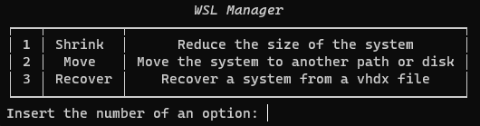
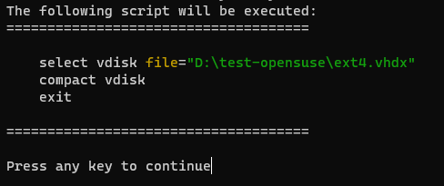
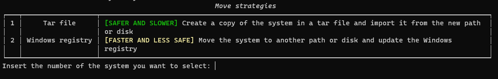

<div align="center">

# WSL Manager

**An easy way to maintain your WSL distros**

It allows you to shrink your distro and move it to another drive or path

[Features](#features) |
[Installation](#installation) |
[Usage](#usage) |
[License](#license) |
[Contributing](#contributing)

</div>

## Status
<a href="https://github.com/LorhanSohaky/wsl-manager/blob/master/LICENSE.md"></a>

<a href="https://github.com/LorhanSohaky/wsl-manager/issues"></a>
<a href="https://github.com/LorhanSohaky/wsl-manager/pulls"></a>

## Features

- Shrink your distro
- Move your distro to another drive or path
- Restore your distro from a vhdx file

## Installation

Download the latest release from the [releases page](https://github.com/LorhanSohaky/wsl-manager/releases/latest).

If you only want to execute the `wsl-manager`, you can download the `wsl-manager.zip` file, extract it and run the `wsl-manager.exe` file.

### Custom build

If you want to build the project yourself, you will need clone the repository and install the dependencies. Here is the commands you need to run:

```bash
poetry install
poetry shell
```

After that, you can run the `build` script to build the project:

```bash
poe build
```


## Usage

When you run the `wsl-manager.exe` file, you will see the following [menu](#main-menu). Here you can choose between shrink and move options.

<a name="main-menu"></a>

### Shrinking

When selecting the shrink option, you will select the distro you want to shrink. After that, you will see the script that will be executed. If you want to continue, just press any key. As you can see in the [image below](#srink-script).

<a name="srink-script"></a>

### Moving

When selecting the move option, you will select the distro you want to move. After that, you will need to select the strategy that you want to use. You can choose between `tar file` and `windows registry`. As you can see in the [image below](#move-strategies).


> **Warning**
>
> The `tar file` strategy uses official `wsl` commands and was used by a lot of people. Nevertheless some people had weird issues that resulted in broken WSL disks.
> Make sure you have a backup of your data, so you can restore in case of an error.

<details><summary>Technical details</summary>
<p>

If you choose `tar file`, internally the code will run `wsl` commands to `export` the distro to a tar file and then `import` the distro from the tar file into the new path. Finally, some `windows registry` keys will be changed to keep the same default user.

If you choose `windows registry`, the code will move the `ext4.vhdx` file to the new path and change the `windows registry` keys that point to the distro path. This is the fastest way to move the distro, **but it should be used at your own risk** because it not used by default by the `wsl`. Finally, some `windows registry` keys will be changed to keep the same default user.
</p>
</details>

<a name="move-strategies"></a>

### Restoring

When selecting the restore option, you will select the vhdx file of the distro you want to restore. After that, you will input the name of the distro and others information.

## License

This project follows the [MIT license](LICENSE.md).

## Contributing

Please read [CONTRIBUTING.md](CONTRIBUTING.md) for details the process for submitting pull requests to us.
